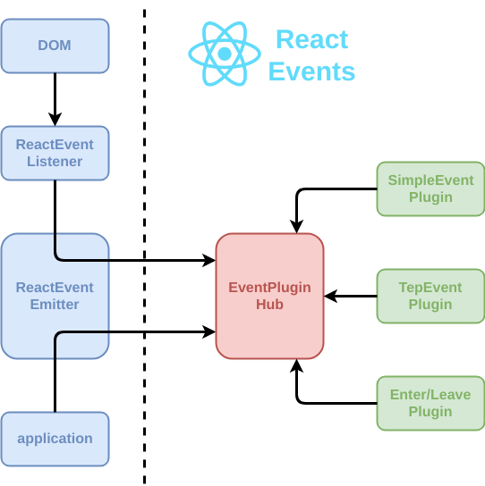

<h1 align="center">React事件绑定</h1>
React自己实现了一套高效的事件注册，存储，分发和重用逻辑，在DOM事件体系基础上做了很大改进，减少了内存消耗，简化了事件逻辑，并最大化的解决了IE等浏览器的不兼容问题。

React源码中有一个注释，解释了整个事件处理系统

> “ReactBrowserEventEmitter”事件处理总结:
>
> - 顶级委托用于捕获大多数本机浏览器事件。这可能只发生在主线程中，并且由ReactDOMEventListener负责，它被注入，因此可以支持可插入的事件源。这是主线程中发生的唯一工作。
>
> - 我们规范和消除重复的事件，以解释浏览器的怪癖。这可以在工作线程中完成。
>
> - 将这些本地事件(带有用于捕获它的相关顶级类型)转发给“EventPluginHub”，后者将反过来询问插件是否想- 提取任何合成事件。
>
> - 然后，“EventPluginHub”将使用“dispatches”对每个事件进行注释，“dispatches”是一组监听器和关心该事件的id序列。
>
> - EventPluginHub 然后分派事件。

> **源码地址:** [*src/events/ReactBrowserEventEmitter.js:32*](https://github.com/facebook/react/blob/b87aabdfe1b7461e7331abb3601d9e6bb27544bc/packages/react-dom/src/events/ReactBrowserEventEmitter.js#L32)

刚开始我看到的是这样的

但是，在进行了一些调试之后，通过堆栈跟踪和React的一些文档，事情就清楚多了。我们把它分解一下，试着把事情简化

