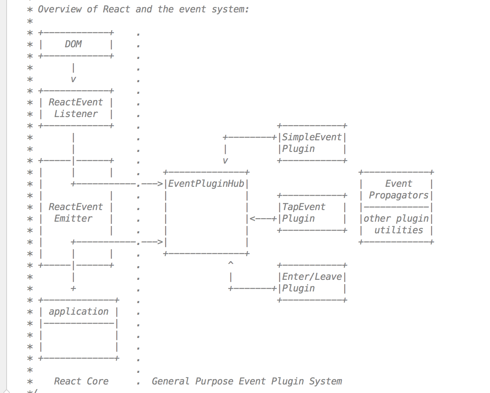

<h1 align="center">React事件绑定</h1>
React自己实现了一套高效的事件注册，存储，分发和重用逻辑，在DOM事件体系基础上做了很大改进，减少了内存消耗，简化了事件逻辑，并最大化的解决了IE等浏览器的不兼容问题。与DOM事件体系相比，它有如下特点

1. React组件上声明的事件最终绑定到了document这个DOM节点上，而不是React组件对应的DOM节点。故只有document这个节点上面才绑定了DOM原生事件，其他节点没有绑定事件。这样简化了DOM原生事件，减少了内存开销
2. React以队列的方式，从触发事件的组件向父组件回溯，调用它们在JSX中声明的callback。也就是React自身实现了一套事件冒泡机制。我们没办法用event.stopPropagation()来停止事件传播，应该使用event.preventDefault()
3. React有一套自己的合成事件SyntheticEvent，不同类型的事件会构造不同的SyntheticEvent
4. React使用对象池来管理合成事件对象的创建和销毁，这样减少了垃圾的生成和新对象内存的分配，大大提高了性能

那么这些特性是如何实现的呢，下面和大家一起一探究竟。

首先看一下React事件系统框图




这上面有几个主要的模块

- ReactEventListener：负责事件的注册。
- ReactEventEmitter：负责事件的分发。
- EventPluginHub：负责事件的存储及分发。
- Plugin：根据不同的事件类型构造不同的合成事件。

这里有一个[动画]([https://www.lzane.com/tech/react-event-system-and-source-code/#%E4%BA%8B%E4%BB%B6%E8%A7%A6%E5%8F%91](https://www.lzane.com/tech/react-event-system-and-source-code/#事件触发))，应该对理解有写帮助。看完之后，我们来看看代码上的实现

第一步就是注册了，注册时机我想不用多说，和挂载props同一时间做的，很显然，绑定事件也是作为props的一部分，看看我们上一节处理这个过程的函数

```js
function finalizeInitialChildren (domElement, props) {
    Object.keys(props).forEach(propKey => {
        const propValue = props[propKey];
        if (propKey === 'children') {
            if (typeof propValue === 'string' || typeof propValue === 'number') {
                domElement.textContent = propValue
            }
        } else if (propKey === 'style') {
        // ...other else if
    })
}
```

上一节细心的朋友可能会发现，这里并没有对事件的处理和绑定，我们这一节就来加上，给它加上一个else分支

```js
else if (registrationNames.includes(propKey) || propKey === 'onChange') {
  let eventType = propKey.slice(2).toLocaleLowerCase()
  if (eventType.endsWith('capture')) {
    eventType = eventType.slice(0, -7)
  }
  document.addEventListener(eventType, dispatchEventWithBatch)
}
```


