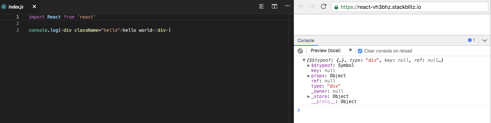
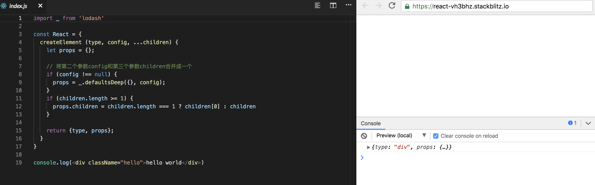

<h1 align="center">React元素</h1>
大家都知道，组件由元素构成，我们这一节主要讨论以下两点

- 什么是React元素
- React元素被创建的过程是怎样的

## 什么是React元素

我们首先来看官方的定义

> 元素是构成 React 应用的最小块 它描述了你在屏幕上想看到的内容。
>
> ```js
> const element = <h1>Hello, world</h1>
> ```
>
> 与浏览器的 DOM 元素不同，React 元素是创建开销极小的普通对象。React DOM 会负责更新 DOM 来与 React 元素保持一致。

可以知道 ```<h1>Hello, world</h1>``` 这一段其实就是一个react元素，表面上看它像一个dom，但注意其中有一句是，**React 元素是创建开销极小的普通对象**，再精简一下就是  **React 元素是对象**

## React元素的创建过程
这个时候，有些朋友就有点懵了，这对象怎么长得和其他的不太一样啊，我们js的对象不是 一对花括号吗？ 我们[打印](https://stackblitz.com/edit/react-rgqanh?embed=1&file=index.js)一下```<h1 className="hello">Hello, world</h1>)```试试看 ，看看结果是什么



原来，果真是一个对象，但这个对象是babel直接生成的么，我们打开[babel的官网](https://babeljs.io/repl/#?babili=false&browsers=&build=&builtIns=false&spec=false&loose=false&code_lz=GYVwdgxgLglg9mABACwKYBt1wBQEpEDeAUIogE6pQhlIA8AJjAG6IToCGAzpwHLsC2qALwByNJjgiAfAAkMWRAHc4ZdPQCEtAPSMmUgNxEAvkSA&debug=false&forceAllTransforms=false&shippedProposals=false&circleciRepo=&evaluate=false&fileSize=false&timeTravel=false&sourceType=module&lineWrap=true&presets=react&prettier=false&targets=&version=7.4.5&externalPlugins=)来转一下试试


原来，babel生成的是```React.createElement(…props)``, 之后是调用**React.createElement**创建了这个对象

我们这一节，就是简单来实现一下React.createElement，我们目前只使用type和props属性

```js
const React = {
  createElement (type, config, ...children) {
    let props = {};

    // 将第二个参数config和第三个参数children合并成一个
    if (config !== null) {
      props = _.defaultsDeep({}, config);
    }
    if (children.length >= 1) {
      props.children = children.length === 1 ? children[0] : children
    }

    return {type, props};
  }
}
```
看一下[效果](https://stackblitz.com/edit/react-h15fdd?embed=1&file=index.js)



到这里，我们已经了解了react元素的创建过程，下一节，我们来讲下react组件

 [下一节](./React组件.md)