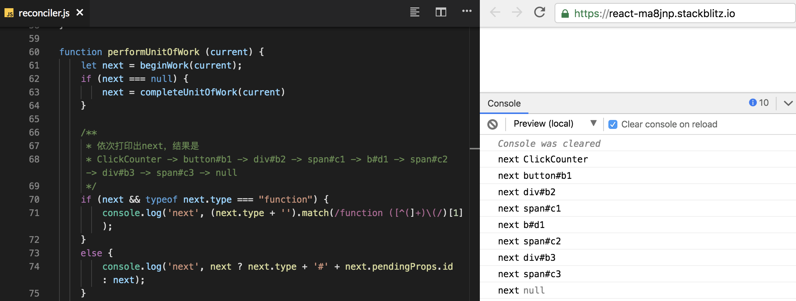
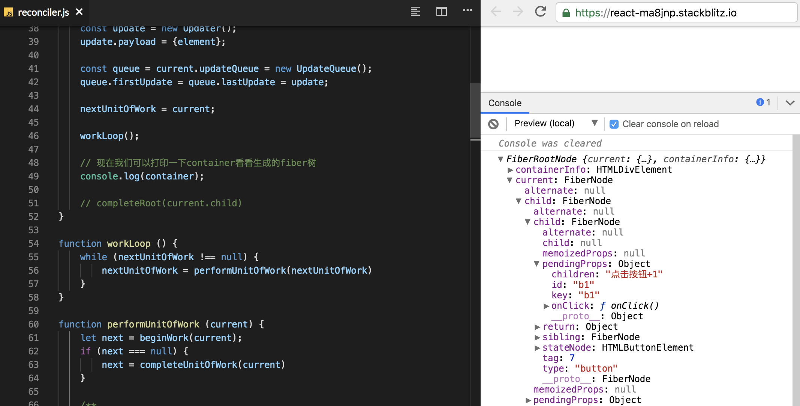

<h1 align="center"> 构建React元素的树</h1>

这一节代码较多，可以通过[这里](https://stackblitz.com/edit/react-ma8jnp?embed=1&file=index.js)，对照着看，我们先来想一个问题

> 如果组件有一个状态改变了，如何精准找到需要修改的dom，然后再进行性能消耗最小的更新呢？

要想实现这个功能，我们需要构建一颗更加完善的树，并且将这棵树的节点与真实dom的节点连接起来，例如我们的ClickCounter组件的状态改变时，我能获得相应的dom，以及父级dom，这样我才能够只在父级dom下做更新

这颗更加完善的树叫 Fiber 树，它反映了用于渲染 UI 的应用程序的状态。有树就有节点，可以先看看它节点长什么样子，我挑选了一些目前我认为很有必要知道的一些属性罗列了下来

## Fiber节点
```js
function FiberNode (tag, pendingProps) {
    /**
     * tag 定义fiber的类型。它在调和算法中用于确定需要完成的工作，为简化，仅介绍以下三个fiber类型
     *    - ClassComponent: 表示用户自定义的 class 组件的 fiber，
     *    - HostRoot:       表示根节点的 fiber，即调用ReactDOM.render时传入的第二个参数 container。
     *    - HostComponent:  表示原生节点的 fiber，如<div>
     */
    this.tag = tag;
    /**
     * 原生节点的type是标签类型，如div的type就是'div'
     * 根节点的type是null
     * class组件的type是它的构造函数
     */
    this.type = null;

    /**
     * HostComponent：原生节点的stateNode是其真实dom
     * HostRoot：根fiber节点的stateNode是FiberRoot的实例
     * ClassComponent：class组件的stateNode是组件类的实例
     */
    this.stateNode = null;

    /**
     * 每一个节点也都有“双生子”，也同样分为current和workInprogress节点，它们通过alternate连接起来
     * 也就是说current.alternate等于workInProgress，而workInprogress.alternate即current
     */
    this.alternate = null;

    /**
     * 已从 React 元素中的新数据更新并且需要应用于子组件或 DOM 元素的 props。
     */
    this.pendingProps = pendingProps;
    /**
     * 在前一个渲染中用于创建输出的 Fiber 的 props
     */
    this.memoizedProps = null;
  
    /**
    *  return，child 和 sibling 这三个属性构造了一颗fiber树，其中
    *  return  为父节点
    *  child   为该fiber的第一个子节点，注意是第一个
    *  sibling 为该fiber的下一个兄弟节点
    */
    this.return = null;
    this.child = null;
    this.sibling = null;
}
```
React为每个React元素创建了一个fiber node，并且因为我们有一个这些**元素的树**，所以我们将拥有一颗fiber node树


<div align="center">图 3-1</div>
## 创建Fiber节点

有了节点的数据格式之后，就可通过createElement返回的数据来创建fiber，源码在[createFiberFromTypeAndProps](https://github.com/facebook/react/blob/769b1f270e1251d9dbdce0fcbd9e92e502d059b8/packages/react-reconciler/src/ReactFiber.js#L414)中，我们可以来实现一个简单版本，将主干逻辑梳理出来

```js
const FunctionComponent = 0; // JavaScript函数组件
const ClassComponent = 1;    // ES6的class组件
const IndeterminateComponent = 2; // 目前还不知道是JavaScript函数还是ES6的class
const HostComponent = 5;     // 原生dom组件

function createFiberFromTypeAndProps (type, props) {
  /**
  * 先根据type判断这是一个什么类型的组件
  * class组件的type是其构造函数，hostComponent的type是标签类型，如<div></div>的type是‘div’
  */
  let fiberTag = IndeterminateComponent
  
  if (_.isString(type)) {
    fiberTag = HostComponent
  }
  
  if (_.isFunction(type) && shouldConstruct(type)) {
    fiberTag = ClassComponent
  }

  const fiber = new FiberNode(fiberTag, props)
  fiber.type = type
  
  return fiber
}

/**
* React.Component上会挂载isReactComponent这个属性
* 当我们的class组件继承React.Component的时候，xxx.prototype.isReactComponent就是true
*/
function shouldConstruct(Component) {
  const prototype = Component.prototype;
  return !!(prototype && prototype.isReactComponent);
}


```

## 容器

React为Fiber树添加了一个容器，容器保存了当前fiber树，以及dom容器等顶级元素

```js
function FiberRootNode(containerInfo) {
  	// current代表当前fiber树的顶级节点
    this.current = null;
  	// containerInfo代表当前dom树的顶级容器节点
    this.containerInfo = containerInfo;
}
```

## 创建容器

同样，知道Fiber容器数据格式之后，我们可以通过dom容器来创建一个Fiber容器，这里做三件事

1. 通过实例化FiberRootNode时传入的containerInfo给containerInfo赋值
2. 实例化之后，创建一个根fiber节点给current赋值
3. 顶层fiber节点的stateNode是容器的实例，赋予之

```js
const ClassComponent = 2;
const HostRoot = 5;
const HostComponent = 7;
/**
 * @param containerInfo 真实dom容器
 * @returns {FiberRootNode}
 */
function createContainer (containerInfo) {
    // 步骤1
    const root = new FiberRootNode(containerInfo);
   	
 		// 步骤2
    const uninitializedFiber = new FiberNode(HostRoot);
    root.current = uninitializedFiber;
    
    // 步骤3
    uninitializedFiber.stateNode = root;

    return root
}
```

React初始化应用（即调用ReactDOM.render）的时候，会传入containerInfo，和reactElement，我们可以根据containerInfo构建容器，然后根据reactElement，构建fiber树。

```js
const ReactDOM = {
    render (reactElement, container) {
        let root = container._reactRootContainer;
        if (!root) {
          // 根据container创建容器root
          root = container._reactRootContainer = createContainer(container)
        }
      	// 根据reactElement，更新现有容器root
        updateContainer(reactElement, root)
    }
};
```

创建容器createContainer我们上面实现过了，我们下面来实现一下更新容器updateContainer


## 首次更新容器 - 构建fiber树

我们之前提到过fiber由三种类型的节点，HostRoot，HostComponent，ClassComponent，这三个不同类型的fiber节点，更新子节点的方式由些不一样

HostRoot的节点，想要更新，需更新ReactDOM.render传入的第一个参数，我们将这个参数放到了更新队列里

HostComponent节点，想要更新，需要根据pendingProps生成新的fiber节点就ok

ClassComponent节点，想要更新，需要实例化它的构造函数，并调用render，遍历dom元素的树，生成fiber树

所以，针对这三种类型的节点，我们需要提供三种不同的更新方式

```js
function updateHostComponent (current) {
    const nextProps = current.pendingProps;
    let nextChildren = nextProps.children;

    if (['string', 'number'].includes(nextProps)) {
        nextChildren = null
    }
    reconcileChildren(current, nextChildren);
    return current.child
}

function updateClassComponent(current, ctor) {
    const instance =  new ctor();
    // ClassComponent的stateNode是它的实例
  	current.stateNode = instance
    const nextChildren = instance.render();

    reconcileChildren(current, nextChildren);

    return current.child
}

function updateHostRoot(current) {
    const updateQueue = current.updateQueue;
    const nextState = updateQueue.firstUpdate.payload;
    const nextChildren = nextState.element;

    reconcileChildren(current, nextChildren);

    return current.child
}
```

可以看到，在这里，我们只是针对不同的fiber节点，按照不同的方式取出它们的子元素，接着统一都调用了**reconcileChildren**这个方法，然后返回这个节点的child

细心的朋友可能会发现，我们刚刚定义的createFiberFromTypeAndProps方法，并没有给节点挂载上return，sibling，child这三个属性，使用这个方法创建的fiber，还是独立的，并未和任何其他的fiber产生关联。

因此，我们除了遍历react元素的树，生成fiber节点之外，还需要做一部分工作，**将它们连接起来**。这就是上面代码中**reconcileChildren**主要做的事情

```js
function reconcileChildren(current, nextChildren) {
    const childArray = Array.isArray(nextChildren) ? nextChildren : [nextChildren]
    current.child = reconcileChildrenArray(current, childArray)
}

function reconcileChildrenArray(returnFiber, childArray) {
    let resultingFirstChild = null;
    let previousNewFiber = null;
    let newIdx = 0;

    for (; newIdx < childArray.length; newIdx++) {
        let _newFiber = createChild(returnFiber, childArray[newIdx]);

        if (resultingFirstChild === null) {
            resultingFirstChild = _newFiber
        }
        else {
            previousNewFiber.sibling = _newFiber
        }
        previousNewFiber = _newFiber
    }
    return resultingFirstChild
}
function createChild (returnFiber, newChild) {
    if (typeof newChild === 'object' && newChild !== null) {
        let created = createFiberFromTypeAndProps(newChild);
        created.return = returnFiber;
        return created
    }
    return null
}
```

到这里，我们可以对这三种类型的节点，都可以构建其子元素的fiber，要想构建出一整颗树，我们只需从上到下，深度优先地去遍历子节点即可，先来看一下遍历的过程


图3-2

当React从树上下来时，进行深度优先的遍历，它首先完成child 节点的工作，然后转移到parent身边

> 注意，垂直连接表示sibling，而弯曲的连接表示child，例如b1没有child，而b2有一个childc1.

根据上图，从ReactDOM.render开始，来实现一遍，从头构建出一颗fiber树

```js
const ReactDOM = {
    render (reactElement, container) {
        let root = container._reactRootContainer;
        if (!root) {
            root = container._reactRootContainer = createContainer(container)
        }
      	// 首次更新容器
        updateContainer(reactElement, root)
    }
};

// react将每个节点的工作拆分成了一个工作单元，最开始我们创建一个空的工作单元
let nextUnitOfWork = null;

// 拿到element，我们先将它挂到curret树到更新队列里，然后循环遍历节点
function updateContainer (element, container) {
    const current = container.current;

    const update = new Updater();
    update.payload = {element};

    const queue = current.updateQueue = new UpdateQueue();
    queue.firstUpdate = queue.lastUpdate = update;

    nextUnitOfWork = current;

  	// 开始遍历更新
    workLoop();

    // 现在我们可以打印一下container看看生成的fiber树
    console.log(container)
}

function workLoop () {
    while (nextUnitOfWork !== null) {
        nextUnitOfWork = performUnitOfWork(nextUnitOfWork)
    }
}

function performUnitOfWork (current) {
    let next = beginWork(current);
    if (next === null) {
        next = completeUnitOfWork(current)
    }
  	
  	// 依次打印出next
    if (next && typeof next.type === "function") {
        console.log('next', (next.type + '').match(/function ([^(]+)\(/)[1]);
    }
    else {
        console.log('next', next ? next.type + '#' + next.pendingProps.id : next);
    }
    return next
}

function beginWork (current) {
    const Component = current.type;
    switch (current.tag) {
        case ClassComponent: {
            return updateClassComponent(current, Component)
        }
        case HostRoot: {
            return updateHostRoot(current)
        }
        case HostComponent: {
            return updateHostComponent(current)
        }
        default:
            throw new Error('unknown unit of work tag')
    }
}
function completeUnitOfWork(current) {
    while (true) {
        const returnFiber = current.return;
        const siblingFiber = current.sibling;

        if (siblingFiber !== null) {
            return siblingFiber
        } else if (returnFiber !== null) {
            current = returnFiber
        } else {
            return null
        }
    }
}
```

我们在performUnitOfWork函数中打印next，看下节点的生成顺序，和图3-2一致



到这里，大部分工作就做完了，我们在workLoop后打印一下container，就可以看到新鲜出炉的fiber树了




但是接下来就又有了一个问题，如何根据这颗fiber树，去生成dom树呢，请看[下一节](./真实DOM的生成.md)

 [上一节: React组件](./React组件.md) | [下一节：真实DOM的生成](./真实DOM的生成.md) 
