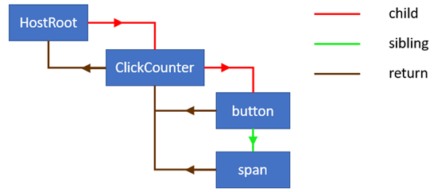
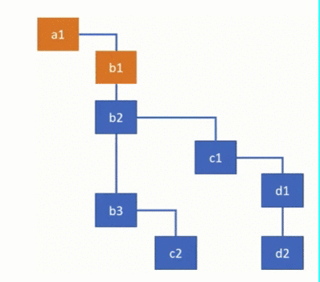

<h1 align="center"> 构建React元素的树（一）</h1>
先来回顾一下[上一节](../React组件/readme.md)最后提到的一个问题

> 如果组件有一个状态改变了，是否要将整个应用重新渲染一遍？能否精准找到需要修改的dom，然后再进行性能消耗最小的更新呢？

要想实现这个功能，我们需要**两颗更加完善的树**，一棵树叫**current**，表示目前页面的状态，另一棵树叫**workInProgress**，它身上，保存着即将应用到页面的状态

树由节点构成，这个节点被称之为fiber，作为一种数据结构，可以先看看人家长什么样子，我挑选了一些目前我认为很有必要知道的一些属性罗列了下来
## Fiber节点
```js
function FiberNode (tag, pendingProps) {
    /**
     * tag 定义fiber的类型。它在调和算法中用于确定需要完成的工作，为简化，仅介绍以下三个fiber类型
     *    - ClassComponent: 表示用户自定义的 class 组件的 fiber，
     *    - HostRoot:       表示根节点的 fiber，即调用ReactDOM.render时传入的第二个参数 container。
     *    - HostComponent:  表示原生节点的 fiber，如<div>
     */
    this.tag = tag;
    /**
     * 原生节点的type是标签类型，如div的type就是'div'
     * 根节点的type是null
     * class组件的type是它的构造函数
     */
    this.type = null;

    /**
     * 原生节点的stateNode是其真实dom
     * 根节点的stateNode是FiberRoot的实例，FiberRoot我们等一会讲
     * class组件的stateNode是组件类的实例
     */
    this.stateNode = null;

    /**
     * 每一个节点也都有“双生子”，也同样分为current和workInprogress节点，它们通过alternate连接起来
     * 也就是说current.alternate等于workInProgress，而workInprogress.alternate即current
     */
    this.alternate = null;

    /**
     * 已从 React 元素中的新数据更新并且需要应用于子组件或 DOM 元素的 props。
     */
    this.pendingProps = pendingProps;
    /**
     * 在前一个渲染中用于创建输出的 Fiber 的 props
     */
    this.memoizedProps = null;
  
    /**
    *  return，child 和 sibling 这三个属性构造了一颗fiber树，其中
    *  return  为父节点
    *  child   为该fiber的第一个子节点，注意是第一个
    *  sibling 为该fiber的下一个兄弟节点
    */
    this.return = null;
    this.child = null;
    this.sibling = null;
}
```
React为每个React元素创建了一个fiber node，并且因为我们有一个这些**元素的树**，所以我们将拥有一颗fiber node树



## Fiber容器

React为每个dom容器创建一个了一个Fiber容器FiberRoot，FiberRoot 保存了当前fiber树，以及dom容器等顶级元素

```js
function FiberRootNode(containerInfo) {
  	// 当前fiber树的顶级节点
    this.current = null;
  	// 当前dom树的顶级容器节点，即传入ReactDOM.render的第二个参数container
    this.containerInfo = containerInfo;
}
```

## 构建Fiber树
### 创建根节点

现在，我们开始创建fiber树。建树，先从根节点建起。fiber 树以特殊类型的fiber节点（HostRoot）开始。它在内部创建并充当最顶层组件的父级

```js
const ClassComponent = 2;
const HostRoot = 5;
const HostComponent = 7;
/**
 * @param containerInfo 真实dom容器
 * @returns {FiberRootNode}
 */
function createFiberRoot (containerInfo) {
    /**
     * 创建fiber容器，注意这是一个容器而并非一个fiber，root.current才是fiber
     */
    const root = new FiberRootNode(containerInfo);
    /**
     * 创建顶层fiber节点，HostRoot
     */
    const uninitializedFiber = new FiberNode(HostRoot);

    /**
     * 将fiber树的顶层节点赋予Fiber容器的current属性
     */
    root.current = uninitializedFiber;
    /**
     * 根据构造函数FiberNode中的注释，可知顶层fiber节点的stateNode是FiberRoot的实例，赋予之
     */
    uninitializedFiber.stateNode = root;

    return root
}
```

### 创建子节点

接下来根据createElement返回的数据来创建fiber，react源码在[createFiberFromTypeAndProps](https://github.com/facebook/react/blob/769b1f270e1251d9dbdce0fcbd9e92e502d059b8/packages/react-reconciler/src/ReactFiber.js#L414)中，我们可以来实现一个简单版本，将主干逻辑梳理出来

```js
const FunctionComponent = 0; // JavaScript函数组件
const ClassComponent = 1;    // ES6的class组件
const IndeterminateComponent = 2; // 目前还不知道是JavaScript函数还是ES6的class
const HostComponent = 5;     // 原生dom组件

/**
* class组件会继承自React.Component组件，而React.Component上会挂载isReactComponent这个属性
* 所以如果你写了一个class组件ClickCounter，访问ClickCounter.prototype.isReactComponent会得到true
*/
function shouldConstruct(Component) {
  const prototype = Component.prototype;
  return !!(prototype && prototype.isReactComponent);
}

function createFiberFromTypeAndProps (type, props) {
  /**
  * 先根据type判断这是一个什么类型的组件
  * class组件的type是其构造函数，hostComponent的type是标签类型，如<div></div>的type是‘div’
  */
  let fiberTag = IndeterminateComponent
  
  if (_.isFunction(type) && shouldConstruct(type)) {
    fiberTag = ClassComponent
  }
  
  if (_.isString(type)) {
    fiberTag = HostComponent
  }
  /**
  * 根据fiberTag创建fiber
  */
  const fiber = new FiberNode(fiberTag, props)
  fiber.type = type
  
  return fiber
}
```

### 构建Fiber树

现在我们能够创建根节点和子节点了，需要做的就是遍历react元素的树，使用fiber节点上的以下属性：child，sibling和return来构成一个fiber node的linked list(链表)

我们先来看一下遍历的过程，当React从树上下来时，可以看到当前活动的fiber节点发生了变化，可以清楚地看到算法如何从一个分支转到另一个分支。它首先完成child 节点的工作，然后转移到parent身边

注意的是：b2是b1的兄弟节点，而不是子节点，b都是a的子节点，c1是b2的子节点，c2是b3的子节点



现在，我们基于上面的过程，来实现这个算法,

首先定义一个创建子节点的方法，通过return属性将父子属性关联起来

```js
function createChild (returnFiber, newChild) {
    if (typeof newChild === 'object' && newChild !== null) {
        let created = createFiberFromTypeAndProps(newChild);
        created.return = returnFiber;
        return created
    }
    return null
}
```

很多情况下，一个父节点会有多个子节点，因此我们需要创建一个方法，创建子组件的时候，将兄弟元素联系起来

```js
function reconcileChildrenArray(returnFiber, childArray) {
    let resultingFirstChild = null;
    let previousNewFiber = null;
    let newIdx = 0;
  
    for (; newIdx < childArray.length; newIdx++) {
        let _newFiber = createChild(returnFiber, childArray[newIdx], expirationTime);

        if (resultingFirstChild === null) {
            /**
            * 结束时大哥会带着一帮小弟回去，如大哥.sibling = 二哥，二哥.sibling = 三弟
            * 因此我们将大哥记住，到时候把大哥带回去就可以了
            */
            resultingFirstChild = _newFiber
        }
        else {
            previousNewFiber.sibling = _newFiber
        }
        
        // 每次将之前的一位兄弟留下来等后面的小弟，不然小弟找不到
        previousNewFiber = _newFiber
    }
    return resultingFirstChild
}
```

到现在，我们只需要创建一个容器，调用根组件，递归调用reconcileChildrenArray，就可以生成这颗fiber树了

```js
function createFiberTree (reactElement, container) {
    // 1. 创建fiber容器
    let root = container._reactRootContainer;

    if (!root) {
        root = container._reactRootContainer = createFiberRoot(container)
    }

    // 2. 用reactElement去更新容器
    updateFiberRoot(reactElement, root);

    return root

}

function updateFiberRoot (element, root) {
    const current = root.current;
    /**
     * 遍历React元素树生成fiber树
     */
    reconcileChildFibers(current, element)
}

/**
 *
 * @param returnFiber 父节点的fiber
 * @param newChild 子节点react元素
 * @returns {*}
 */
function reconcileChildFibers(returnFiber, newChild) {
    const childArray = Array.isArray(newChild) ? newChild : [newChild];
    return reconcileChildrenArray(returnFiber, childArray)
}
```

