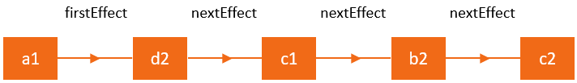

<h1 align="center"> React副作用 </h1>

通过上一节，我们创建了一颗工作树，工作树上有即将应用到current树的fiber，以及即将应用到页面的dom，那么，当组件的状态改变的时候，又发生了哪些事呢？我们这一节，就来探讨这个问题

我们还是以ClickCounter为例，当点击按钮，state从0变成1，页面是如何更新的

## React副作用

React副作用（effect），我们以程序员的视角来看这两个东西。

所谓[副作用](https://zh-hans.reactjs.org/docs/hooks-overview.html#effect-hook)，其实也是fiber，它会通过一个属性effectTag来标识是那种类型的副作用，其枚举值源码在[这里](https://github.com/facebook/react/blob/504576306461a5ff339dc99691842f0f35a8bf4c/packages/shared/ReactSideEffectTags.js)查看，这里就挑几个作为示例

```js
const NoEffect = /*              */ 0b000000000000;	// 0
const PerformedWork = /*         */ 0b000000000001; // 1

const Placement = /*             */ 0b000000000010; // 2
const Update = /*                */ 0b000000000100; // 4
const PlacementAndUpdate = /*    */ 0b000000000110; // 6
const Deletion = /*              */ 0b000000001000; // 8
```

读者同学可能会发现，这个值好像和长得有点特殊，为什么是用二进制来表示？细心发现，这里每一个1的位置都不一样，其实，这里是用了一种[复合类型方案的设计](https://segmentfault.com/a/1190000016284033)，每个1的位置代表了一种属性，组合起来就代表了多种属性，通过使用位运算，能够使我们很快地对副作用进行增删改查

React 处理更新非常迅速，为了达到这种水平的性能，它采用了一些有趣的技术。**其中之一是构建具有副作用的 Fiber 节点的线性列表，从而能够快速遍历。**遍历线性列表比树快得多，并且没有必要在没有副作用的节点上花费时间。

Dan Abramov 为副作用列表提供了一个类比。他喜欢将它想象成一棵圣诞树，「圣诞灯」将所有有效节点捆绑在一起。为了使这个可视化，让我们想象如下的 Fiber 节点树，其中标亮的节点有一些要做的工作。我们将需要做的任务通过一根线串起来，等到真正要执行的时候，我们从a1开始，将任务一个接一个地拿出来做


React通过firstEffect指针来确定列表的起始位置，之后通过nextEffect属性将每个effect连接在一起，如下




以ClickCounter为例，当点击按钮，调用this.setState将state从0变成1的时候，我们首先会通过this得到ClickCounter的实例，继而得到它的fiber（react组件一节中有提到如何得到），然后通过这个fiber向上回溯找到根root，然后继续按照创建fiber树的方式遍历节点，但是这一次会通过比较两棵树的差异给每个节点做上标记，

开始的时候，我们还是和上一节一样，基于current树再创建一颗workInProgress树，区别在于，这一次current树不再是空的了，它有与页面完全对应的fiber节点以及dom节点，但我们基于current树生成的workInProgress一开始啥都没有，而是一层层往下遍历，拿将要更新的type，props等属性和原先的做对比，如果发现没有改动就将之前的做一份克隆，如果发现有fiber节点不一样，就给它标记上副作用，如发现原来有的节点现在没有了，就给这个fiber标记上Delection

```js
for (; oldFiber !== null && newIdx < newChildren.length; newIdx ++) {
  // 如果新fiber和旧fiber同时存在的话，那么我们就基于旧的fiber创建一个新的fiber，创建之后这两个fiber也互相连接了起来
  // 新fiber可以通过alternate访问旧fiber，反之毅然
  let newFiber = updateSlot(returnFiber, oldFiber, newChildren[newIdx])
  
  // 如果旧fiber存在而新fiber不存在，那么代表这个节点被删除了
  if (oldFiber && newFiber.alternate === null) {
    deleteChild(returnFiber, oldFiber)
    newFiber.effectTag = Placement
  }
}

function updateSlot (returnFiber, oldFiber, newChild, expirationTime) {
  if (typeof newChild === 'object' && newChild !== null) {
    return updateElement(returnFiber, oldFiber, newChild, expirationTime)
  }
  return null
}

function updateElement (returnFiber, current, element, expirationTime) {
  if (current !== null && current.type === element.type) {
    const existing = useFiber(current, element.props, expirationTime)
    existing.return = returnFiber
    return existing
  } else {
    const created = createFiberFromElement(element, expirationTime)
    created.return = returnFiber
    return created
  } 
}
// 这样，我们生成的fiber节点就可以通过alternate属性找到current树的fiber节点，也方便后续做对比更新
function useFiber (fiber, pendingProps, expirationTime) {
  let clone = createWorkInProgress(fiber, pendingProps, expirationTime)
  clone.sibling = null
  return clone
}
```

这里面diff与复用的过程，我们可以参考[官网的说法](https://zh-hans.reactjs.org/docs/reconciliation.html#the-diffing-algorithm)，这里就不再详谈

接下来我们又生成了一颗workInProgress树，而且workInProgress树的很多子节点是和current树的子节点是互相可访问的

那么现在，我们依然使用上一章的算法，构建fiber树是从上到下的，当到达一个分支的最后一个节点的时候，如果有变动的话，就开始创建effect-list了

继续以下面这个jsx为例子

```js
render() {
  return [
    <button key="b1" id="b1" onClick={_ => this.handleClick()}>点击按钮+1</button>,
    <div key="b2" id="b2"><span id="c1"><b id="d1">{this.state.count}</b></span></div>,
    <div key="b3" id="b3"><span id="c2">{this.state.count}</span></div>
  ]
}
```

点击按钮+1后，通过ClickCounter的实例调用render,返回react元素的树，从上到下构建fiber树，到达底部时，自底向上，通过对比两棵树来构建effect，然后像上回溯，当发现父节点的effectTag为Incomplete时，就需要给父节点添加effect，当父节点的lastEffect为null时，代表父节点还没有effect-list，那么就开始构建一个，如下是删除一个节点时的effect-list构建过程

```js
function deleteChild (returnFiber, childToDelete) {
  const last = returnFiber.lastEffect
  if (last !== null) {
    last.nextEffect = childToDelete
    returnFiber.lastEffect = childToDelete
  } else {
    returnFiber.firstEffect = returnFiber.lastEffect = childToDelete
  }
  childToDelete.nextEffect = null
  childToDelete.effectTag = Deletion
}
```

