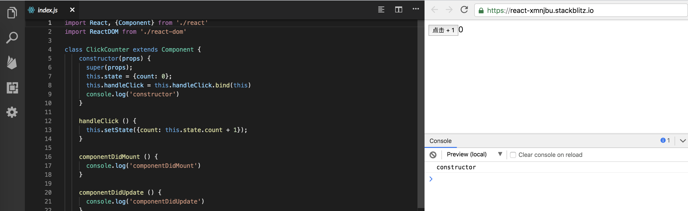

<h1 align="center"> React组件 </h1>
通过[上一节](./React元素.md)我们简单了解了元素以及它的创建过程。而元素构成组件，我们这一节主要探讨React组件以及如何将React组件的内容渲染到页面上

## 什么是React组件

来自官网的定义

> 组件，从概念上类似于 JavaScript 函数。它接受任意的入参（即 “props”），并返回用于描述页面展示内容的 React 元素。

精简一下，就是，react组件是函数，定义组件的方式可以是JavaScript函数和ES6的class，我们这一节主要探讨一下class组件的实现

```jsx
class ClickCounter extends Component{
    constructor(props) {
        super(props);
        this.state = {count: 0};
        this.handleClick = this.handleClick.bind(this);
				console.log('constructor')
    }

    handleClick() {
        this.setState((state) => {
            return {count: state.count + 1};
        });
    }

    componentDidMount () {
    		console.log('componentDidMount')
    }
    
    componentDidUpdate () {
    		console.log('componentDidUpdate')
    }
    
    render() {
        return [
            <button key="1" onClick={this.handleClick}>Update counter</button>,
            <span key="2">{this.state.count}</span>
        ]
    }
}

ReactDOM.render(<ClickCounter />, document.getElementById('root'))
```

先来看一下实际的[效果](https://stackblitz.com/edit/react-ykafkp?embed=1&file=index.js)


可以看到

1. render中的内容被渲染到了页面上，控制台依次输出constructor,  componentDidMount
3. 点击按钮后页面count加1，控制台依次输出addCount, componentDidUpdate

## React组件的创建过程

以上的功能是如何实现的呢？先来看第一点

### 将内容渲染到页面上

先来看第一点，如果**只是**为了实现这个功能的话，就很简单，实例化ClickCounter，调用render获取子节点元素，递归创建dom，插入到div#app上，就可以了，这一段大家可以先行自己实现一遍

以下是我的版本

```js
function render (reactElement, container) {
  const Component = reactElement.type;
  
  // 实例化
  const inst = new Component();
  
  // 将父节点挂载到实例上，方便后续调用
  inst.parent = container;
  
  // 调用render获取子节点元素
  const children = inst.render();
  
  // 递归创建dom，插入到div#app上， 
  // renderChildren的具体代码在lesson2/index.html中查看
  container.appendChild(renderChildren(children))
  
  // 执行生命周期方法compoenntDidMount
  if (inst.componentDidMount) {
    inst.componentDidMount.call(inst)
  }
}
```

到这一步，我们将react和react-dom的链接注释掉，测试这一段代码是否能实现功能1

### 触发页面更新

能看见的流程是，点击按钮后应该触发addCount方法，继而触发setState方法，setState方法改变状态，同时更新界面内容

首先是触发addCount方法，如何触发呢？onClick并不是原生dom的事件，因此事件这一块需要单独处理

```js
const dom = document.createElement(type);

// 定义驼峰的事件，由于我们目前只用到onClick，所以只加这一个
const registrationNames = ['onClick'];

if (registrationNames.includes(key)) {

    // onClick再转为click，监听之
    // 有同学说这不就是脱裤子放屁？当然不是了，具体原因后面再谈，先可以自己多想想
    const eventType = key.slice(2).toLocaleLowerCase();
    
    dom.addEventListener(eventType, value);
}
```

接下来是**setState方法改变状态，同时更新界面内容**

有同学会说，先改变状态，继续调用render，然后将返回的元素转成真实dom，直接插入到父元素就ok了呗，so easy！如下

```js
function Component(props) {
  this.props = props
}

Component.prototype.setState = function (partialState) {
  this.state = {
    ...this.state,
    ...partialState
  };
  
  this.parent.innerHTML = '';
  this.parent.appendChild(renderChildren(this.render()));
};

React.Componet = Component
```

看下[效果](https://stackblitz.com/edit/react-xmnjbu?embed=1&file=index.js)，我们替换了React和React-dom的引用，可以看到也实现了上述的两个功能




当然，要是说React就这么简单，那也太侮辱智商了，下一节，我将会给大家带来React另外一个概念，React元素的树，React能够非常快速地更新，并且为了实现高性能，不可能每次更新dom就从头再来渲染一次，它采用了一些有趣的技术，而这些，都是基于react元素的树而来的


[代码](index.html) | [上一节: React元素](./React元素.md) | [下一节：React元素的树](./React元素的树.md) 

