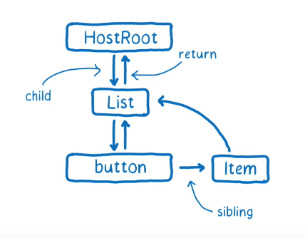

## 实现ReactComponent

通过[上一节](./实现ReactElement.md)我们知道，元素构成组件，那么组件又是什么呢，这一节我们主要讨论以下几点

- 什么是react组件
- react组件有什么功能
- react组件是如何被创建的

### 什么是react组件

来自官网的定义

> 组件，从概念上类似于 JavaScript 函数。它接受任意的入参（即 “props”），并返回用于描述页面展示内容的 React 元素。

精简一下，就是，react组件是函数，接收入参并返回元素，用代码表示就是

```js
const HelloWorld = _ => <div>Hello world!</div>
```

那么，HelloWorld就是一个组件，就是这么简单

### react组件有什么功能

首先需要知道的是，react组件分为函数式组件和class组件，它们的最大的区别在于，函数式组件没有**内部状态**，没有**生命周期**，而class组件有

对于函数式组件，其实就是定义一个函数，根据入参返回一堆react元素就行了，这里并不需要react额外处理什么

而class组件会有以下这些功能

1. 继承React.Component或者React.PureComponent的组件会拥有一个setState方法，调用这个函数后会改变组件的state值，并触发真实dom更新
2. 有生命周期方法，在组件的各个阶段依次执行

### react组件是如何被创建的

#### 实现setState

我们先来看第一点

> 继承React.Component的组件或者React.PureComponent的组件会拥有一个setState方法，调用这个函数后会改变组件的state值，并触发真实dom更新

我们以以下这个组件作为例子

```js
class AddCount extends React.component {
  state = {count: 1},
  addCount = _ => this.setState({count: this.state.count + 1})
  render () {
    return (
      <>
        <div>{this.state.count}</div>
        <button onClick={this.addCount}>+1</button>
      </>
    )
  } 
}
```

点击按钮，调用this.setState，改变state的值，并且页面的dom随之更新

首先setState肯定是React.component的原型方法，我们不可能凭空调用它，现在我们根据以上功能，来实现一个简单的React.Component

```js
function Component(props) {
  this.props = props;
}
Component.prototype.setState = function(partialState) {
  this.state = {...this.state, ...partialState}
};
```

这样，状态是改变了，怎么更新dom呢？


嗯，有同学会说，调用render，然后将返回的元素转成真实dom，直接插入到父元素就ok了呗，so easy！

很好，but，这里有几个问题

1. 如何确定真实dom中的父元素
2. 如果组件有一个状态改变了，是否要将整个应用重新渲染一遍？能否精准找到需要修改的dom，然后再进行性能消耗最小的更新呢？


思考两分钟后，我们发现


1. react元素提供的属性中并没有parent，无法直接找到父元素
2. 必须要有两棵树来进行差异分析，才能够精确定位需要修改的地方，而这个我们目前也没有


要想实现上面功能，我们需要**一个更加复杂，更加完善的虚拟dom树**，出于性能，我们还要有**两颗**，并且将虚拟dom树中相关的节点和组件实例**连接**起来。

先来看一下这个更加复杂，更加完善的虚拟dom节点长啥样

```js
interface Tag {
  ClassComponent: 1, // 表示用户自定义的 class 组件的 fiber
  HostRoot: 3,  		 // 表示根节点的 fiber，即调用ReactDOM.render时传入的第二个参数 container。
  HostComponent: 5 	 // 原生节点的 fiber，如<div>
}

// 一个 fiber 对应了一个节点，
function FiberNode (tag, pendingProps) {
  // 节点可以是自定义组件<HelloWorld>，原生节点<div>。也可以是根节点HostRoot，根节点的概念我们待会再讲
  // 因此fiber也有不同的类型，用tag表示。
  // 为简化，只支持原生节点（HostComponent），根节点（HostRoot），原生节点（HostComponent）三个类型
  this.tag = tag
  
  // 原生节点的type是标签类型，如div的type就是'div'
  // 根节点的type是null
  // class组件的type是它的构造函数
  this.type = null
  
  // 原生节点的stateNode是其真实dom
  // 根节点的stateNode是FiberRoot的实例，FiberRoot我们等一会讲
  // class组件的stateNode是组件类的实例
  this.stateNode = null
  
  // return，child 和 sibling 这三个属性构造了一颗fiber树。如下图
  this.return = null
  this.child = null
  this.sibling = null
}
```



所以，生成虚拟dom的时候，需要将其和相应的更新机制，挂载到当前组件实例上

```js
const inst = new AddCount() // 实例化
// 给实例挂载上虚拟dom节点，我们叫它fiber
inst._reactInternalFiber = fiber
// 给实例挂上相应的更新机制
inst.updater = {
  enqueueSetState (inst, payload) {
      // 根据自身实例获取当前组件的虚拟dom节点 fiber
      const fiber = inst._reactInternalFiber
      
      // 创建一次更新
      const update = createUpdate()
      update.payload = payload
    
      // 将更新和当前的fiber入队列
      enqueueUpdate(fiber, update)
      // 执行更新
      scheduleWork(fiber, expirationTime)
  }
}
```
当调用setState的时候，setState就可以直接通过this.updater.enqueueSetState来更新dom

```js

/**
* 调用setState的时候，直接取updater里的enqueueSetState方法，传入this和待更新的state，触发更新
*/
Component.prototype.setState = function(partialState) {
  this.updater.enqueueSetState(this, partialState)
};

```

#### 实现生命周期

因为每一个生命周期函数的调用时机，都在dom渲染和再渲染的前后，因此生命周期函数必然也是由react-dom来调用的, 之前说过，需要有两颗虚拟dom树，其中一颗代表着当前页面长成啥样，我们叫它current，另外一颗代表**将要**长成啥样，我们叫它workInProgress

最开始，我们就可以判断，如果这个组件还没有相应的虚拟dom节点的时候，那么这是第一次更新，我们就可以调用

```j s
getDerivedStateFromProps
```

过程如下

```js
const classComponentUpdater = {
  enqueueSetState (inst, payload) {
      // 根据自身实例获取当前组件的虚拟dom节点 fiber
      const fiber = inst._reactInternalFiber
      
      // 创建一次更新
      const update = createUpdate()
      update.payload = payload
    
      // 将更新和当前的fiber入队列
      enqueueUpdate(fiber, update)
      // 执行更新
      scheduleWork(fiber, expirationTime)
  }
}

function updateClassComponent (current, workInProgress, Component， nextProps) {
    let shouldUpdate
    // 当前组件还没有虚拟dom节点，直接实例化，然后装载（mount）组件
    if (current === null) {
      // 实例化
      let instance =  new Component(nextProps)
      instance._reactInternalFiber = workInProgress
      // 给组件实例挂载上更新机制
      instance.updater = classComponentUpdater
      // 给workInProgress树的虚拟dom节点 挂载上当前实例
    	workInProgress.stateNode = instance
      
      
      const getDerivedStateFromProps = Component.getDerivedStateFromProps
      // 如果当前实例上定义了这个生命周期方法，则调用之
      if (typeof getDerivedStateFromProps === 'function') {
        applyDerivedStateFromProps(workInProgress, getDerivedStateFromProps, newProps)
        instance.state = workInProgress.memoizedState
      }
   }
}
```

接下来是调用render，根据上一节我们知道，这会生成一个dom树结构，我们根据这个dom树，生成一个更加复杂的虚拟dom树，包含了state，props，parent等等

现在我们将两棵树进行对比，得到需要更新的地方之后，重新渲染真实dom，渲染完事之后，就可以调用

```js
componentDidMount
```

等到下一次需要更新之前，我们就可以调用

```js
componentDidMount
```

，因此只要在自身组件上写好生命周期函数，到了相应的时间点，react-dom 通过之前传入的this 找到这个组件对应的生命周期函数，直接调用就可以了，具体细节，我们在后面讲到react-dom的时候再详谈

[文中代码链接](./lesson2/ReactComponent.js)

[上一节：实现ReactElement](./实现ReactElement.md) [下一节：构建虚拟DOM树](./构建虚拟DOM树.md)

