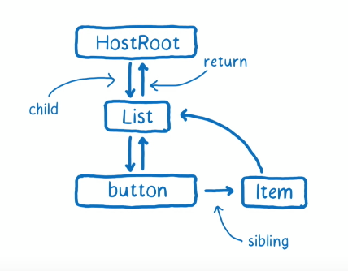

## 构建虚拟DOM树（一）

我们先来回顾一下 [上一节](../实现ReactDOM.render/README.md) 最后提到的一个问题

> 如果组件有一个状态改变了，是否要将整个应用重新渲染一遍？能否精准找到需要修改的dom，然后再进行性能消耗最小的更新呢？

要想实现这个功能，我们需要**两颗更加复杂，更加完善的虚拟dom树**，并且需要将虚拟dom树中的虚拟节点和组件实例**连接**起来。
树由节点构成，先来看一下节点长成啥样，在react里，节点我们叫它fiber

```js
function FiberNode (tag, pendingProps) {
  /**
  * 节点可以是自定义组件<HelloWorld>，原生节点<div>。也可以是根节点HostRoot
  * 因此fiber也有不同的类型，用tag表示，为简化，只支持ClassComponent，HostRoot，HostComponent三个类型，其中
  * ClassComponent表示用户自定义的 class 组件的 fiber，
  * HostRoot表示根节点的 fiber，即调用ReactDOM.render时传入的第二个参数 container。
  * HostComponent表示原生节点的 fiber，如<div>
  */
  this.tag = tag
  
  /** 
  * 原生节点的type是标签类型，如div的type就是'div'
  * 根节点的type是null
  * class组件的type是它的构造函数
  */
  this.type = null
  
  /**
  * 原生节点的stateNode是其真实dom
  * 根节点的stateNode是FiberRoot的实例，FiberRoot我们等一会讲
  * class组件的stateNode是组件类的实例
  */
  this.stateNode = null
  
  /**
  * return，child 和 sibling 这三个属性构造了一颗fiber树。如下图
  */
  this.return = null
  this.child = null
  this.sibling = null
}
```


ok，现在节点有了，我们就可以依据节点的格式和dom树来生成fiber树了么？


接下来，生成这个虚拟DOM时，需要将其和相应的更新机制，挂载到当前组件实例上

```js
const inst = new AddCount() // 实例化
// 给实例挂载上虚拟dom节点，我们叫它fiber
inst._reactInternalFiber = fiber
// 给实例挂上相应的更新机制
inst.updater = {
  enqueueSetState (inst, payload) {
      // 根据自身实例获取当前组件的虚拟dom节点 fiber
      const fiber = inst._reactInternalFiber
      
      // 创建一次更新
      const update = createUpdate()
      update.payload = payload
    
      // 将更新和当前的fiber入队列
      enqueueUpdate(fiber, update)
      // 执行更新
      scheduleWork(fiber, expirationTime)
  }
}
```
当调用setState的时候，setState就可以直接通过this.updater.enqueueSetState来更新dom

```js

/**
* 调用setState的时候，直接取updater里的enqueueSetState方法，传入this和待更新的state，触发更新
*/
Component.prototype.setState = function(partialState) {
  this.updater.enqueueSetState(this, partialState)
};

```


未完待续….
