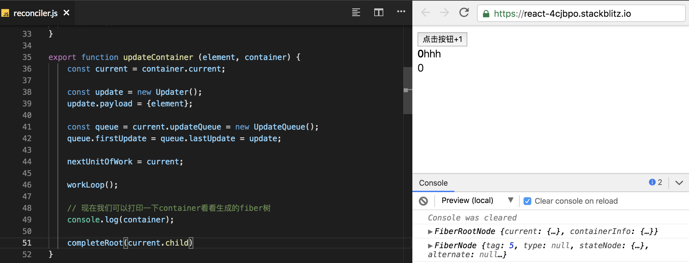

<h1 align="center">真实DOM的生成</h1>

本节代码[地址](https://stackblitz.com/edit/react-zewnpq?embed=1&file=src/lib/reconciler.js)

通过上一节，我们了解了创建一颗Fiber树的过程，但是却不知道这颗fiber树是如何生成真实dom且应用到页面上的

之前提到过，HostComponent类型的fiber节点，stateNode属性上挂载着这个fiber对应的真实DOM节点，实际上，在生成fiber树的时候，会一并生成真实DOM节点，然后再挂载上去，这一节主要来完善一下这个功能

换句话来说，主要是完善一下completeUnitOfWork这个函数，首先看一下上一节的实现

```js
function completeUnitOfWork(current) {
    while (true) {
        const returnFiber = current.return;
        const siblingFiber = current.sibling;
      
        if (siblingFiber !== null) {
            return siblingFiber
        } else if (returnFiber !== null) {
            current = returnFiber
        } else {
            return null
        }
    }
}
```

我们这一节需要做的是，就是在这个过程中，不断的生成相应节点dom，并挂载到fiber树的stateNode属性上

```js
function completeUnitOfWork(current) {
    while (true) {
        const returnFiber = current.return;
        const siblingFiber = current.sibling;
      
      	completeWork(current）

        if (siblingFiber !== null) {
            return siblingFiber
        } else if (returnFiber !== null) {
            current = returnFiber
        } else {
            return null
        }
    }
}
```

接下来，实现一下这个completeWork

```js
function completeWork (current) {
    const newProps = current.pendingProps;

    switch(current.tag) {
        case ClassComponent: {
            break
        }
        case HostRoot: {
            break
        }
        case HostComponent: {
            const type = current.type;

            // 生成dom实例
            const _instance = document.createElement(type);

            // 给dom也挂上fiber节点，用于后续给dom绑定事件，事件触发时
            // 我们可以通过event.target获取到真实dom，之后可以通过这个属性获取到相应的fiber
            _instance.internalInstanceKey = current;
            _instance.internalEventHandlersKey = newProps;

            // 插入子元素
            appendAllChildren(_instance, current);

            // 挂载上属性props
            finalizeInitialChildren(_instance, newProps);

            // 将dom挂载在current.stateNode上
            current.stateNode = _instance;
            break
        }
        default: {
            throw new Error('Unknown unit of work tag')
        }
    }

    return null
}
```

为什么遇到ClassComponent，和HostRoot就直接break，因为它们无法生成真实dom，ClassComponent的stateNode是组件类的实例，HostRoot节点的stateNode是FiberRoot的实例，只有HostComponent节点的stateNode是真实dom

最后，我们生成这个fiber的真实dom之后，需要将子元素都插入进去，即```parent.appendChild(child.stateNode)```

```js
function appendAllChildren (parent, current) {
    let node = current.child;
    while (node !== null) {
        if (node.tag === HostComponent) {
            parent.appendChild(node.stateNode)
        } else if (node.child !== null) {
            node.child.return = node;
            node = node.child;
            continue
        }
        // 从下往上走，走到了current这一层就退出
        if (node ===  current) {
            return
        }
        // 没有兄弟节点，继续往上走，一直走到current这一层，退出
        while (node.sibling === null) {
            if (node.return === null || node.return === current) {
                return
            }
            node = node.return
        }
        // 有兄弟节点，兄弟节点接起任务继续往上走
        node.sibling.return = node.return;
        node = node.sibling
    }
}
```

同时，给该真实dom挂载上相应的props

```js
function finalizeInitialChildren (domElement, props) {
    Object.keys(props).forEach(propKey => {
        const propValue = props[propKey];
        if (propKey === 'children') {
            if (typeof propValue === 'string' || typeof propValue === 'number') {
                domElement.textContent = propValue
            }
        } else if (propKey === 'style') {
            const style = domElement.style;
            Object.keys(propValue).forEach(styleName => {
                let styleValue = propValue[styleName];
                style.setProperty(styleName, styleValue)
            })
        } else if (propKey === 'className') {
            domElement.setAttribute('class', propValue)
        } else {
            const propValue = props[propKey];
            domElement.setAttribute(propKey, propValue)
        }
    })
}
```

最后，我们再打印一下container，就可以发现，每个HostComponent类型的fiber节点中，都挂着上了stateNode属性，这个stateNode就是这个fiber对应的真实dom

将节点的真实dom生成之后，我们就可以将真实dom渲染到页面上了, 我们在updateContainer最后加上一个```completeRoot```方法

```js
function updateContainer (element, container) {
    const current = container.current;

    const update = new Updater();
    update.payload = {element};

    const queue = current.updateQueue = new UpdateQueue();
    queue.firstUpdate = queue.lastUpdate = update;

    nextUnitOfWork = current;

  	// 开始遍历更新, 生成fiber树并挂载上各自的真实dom
    workLoop();
  
    // 现在我们可以打印一下container看看生成的fiber树
    console.log(container)
  
  	// 将真实dom渲染到页面上
  	completeRoot(current.child)
}
```

然后来实现一下completeRoot

```js
function completeRoot(finishedWork) {
    const parentFiber = getHostParentFiber(finishedWork);
    const parent = parentFiber.stateNode.containerInfo;
    let node = finishedWork;
    while (true) {
        if (node.tag === HostComponent) {
            parent.appendChild(node.stateNode)
        } else if (node.child !== null) {
            node.child.return = node;
            node = node.child;
            continue
        }
        if (node === finishedWork) {
            return
        }
        while (node.sibling === null) {
            if (node.return === null || node.return === finishedWork) {
                return
            }
            node = node.return
        }
        node.sibling.return = node.return;
        node = node.sibling
    }
}

function getHostParentFiber(fiber) {
    let parent = fiber.return;
    while (parent !== null) {
        if (isHostParent(parent)) {
            return parent
        }
        parent = parent.return
    }
}

function isHostParent(fiber) {
    return fiber.tag === HostComponent || fiber.tag === HostRoot
}
```

最后再在浏览器中打开index.html文件，可以看出dom已经被渲染出来了



这一节，我们了解了react是如何将reactElement转变为真实dom的过程，下一节，我们将来讨论react是如何完成事件绑定的


[上一节: React元素的树](../React元素的树/readme.md)  | [下一节: React事件绑定](../React事件绑定/readme.md) 
